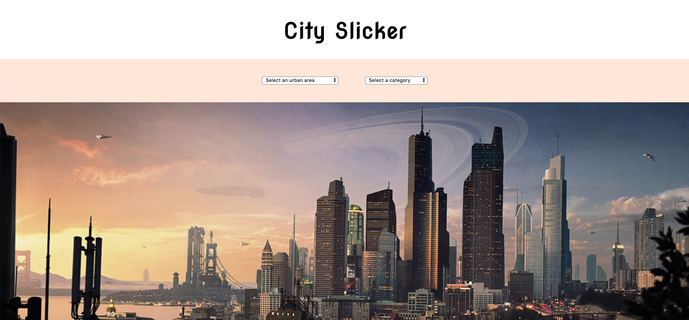
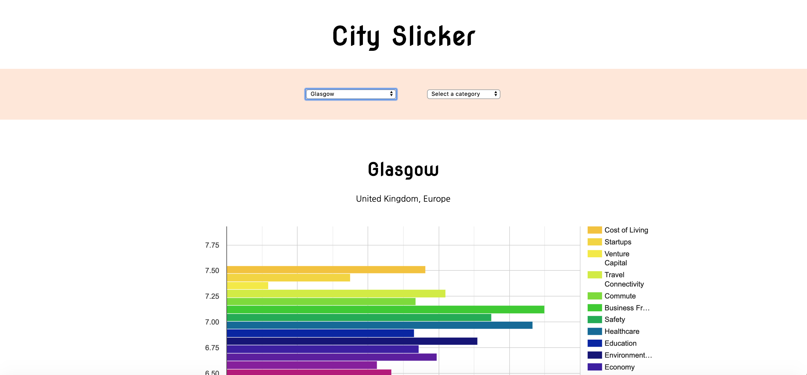
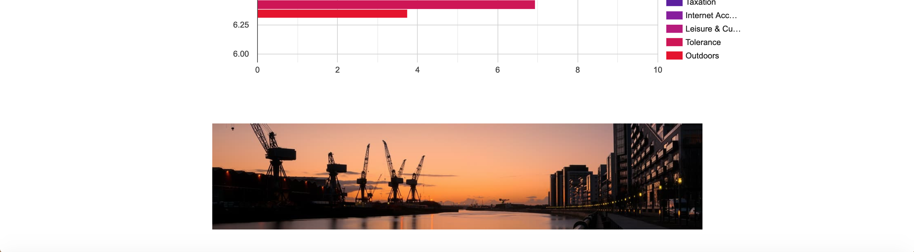
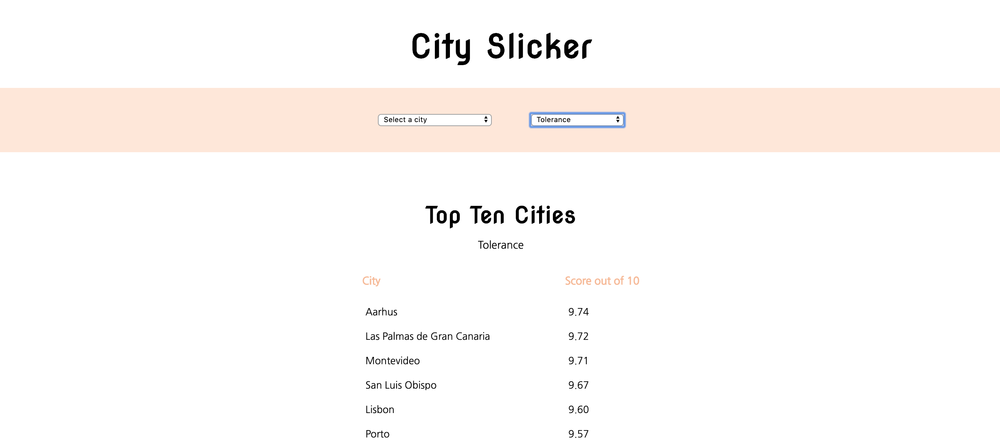

# City Slicker
**Individual Project: JavaScript, Vue.js**

## The Project
City Slicker is a JavaScript Vue application using an [external API](https://developers.teleport.org/api/reference/) and Google Charts to visually display statistics comparing quality of life data of 266 cities worldwide, to help assist people find the cities that best match their needs.

The app provides a drop-down list of cities and a drop-down list of each category. Users can either select a city to retrieve the data specific to that city, or they can select a category to view the top ten cities that maintain the highest scores for that category.

[Project Brief](https://gist.github.com/futuresocks/031986766572aaecdbaffc17adf495f8)

## Screen grabs


-> _Homepage_



-> _Selected city data_



-> _Selected category top ten cities_

## Build Setup
``` bash
# install dependencies
npm install

# Compiles and hot-reloads for development
npm run serve

# Compiles and minifies for production
npm run build

# Run your tests
npm run test

# Lints and fixes files
npm run lint
```
### Customize configuration
See [Configuration Reference](https://cli.vuejs.org/config/).
